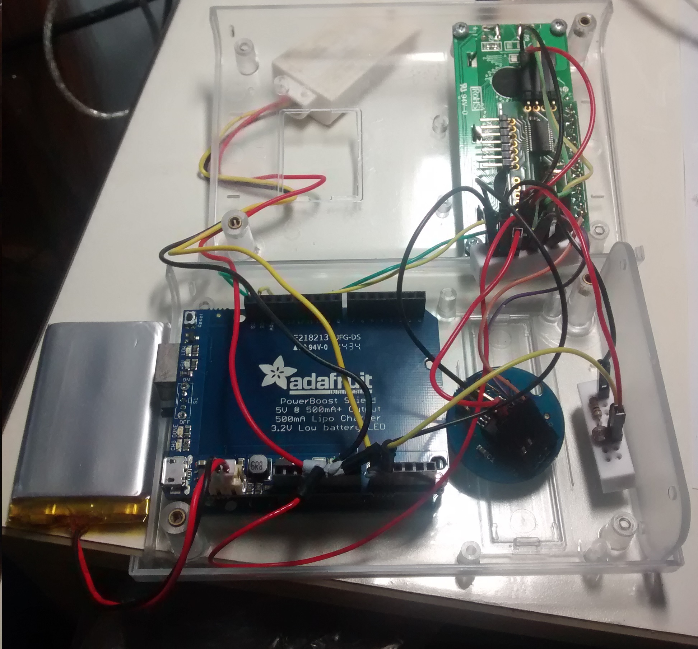
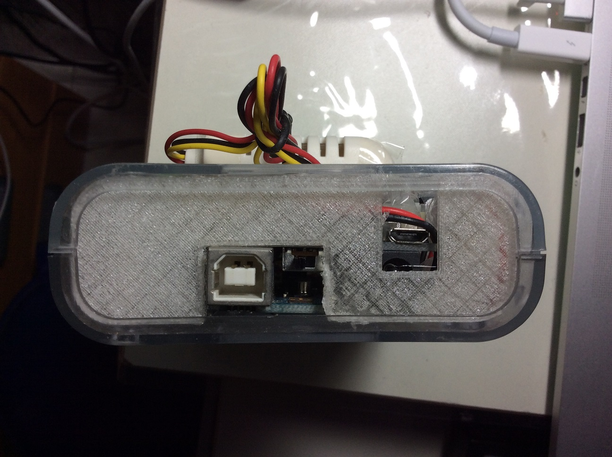

sensor_clock_2
==============

A clock composed of an Arduino, temperature and humidity sensors. A light-dependent resistor (LDR) is included to dynamically switch on/off the backlight depending on the surrounding light conditions. Includes integrated charger. Simpler than the  [previous sensor-clock](https://github.com/yeokm1/sensor-clock).

The white AM2302 temperature/humidity sensor is placed externally to prevent heat from the Arduino from affecting the measurement.

Innards.

Because of the extra charging connector, I cannot use the default plastic case that came with the case. This base is designed and 3D-printed by me. The Designspark Mechanical and STL files are also in this repo.

<b>Main Parts used:</b>  

1. Arduino UNO R3  (An Uno or other boards will work too)  
2. I2C LCD based on LCD03  
3. AM2302 temperature and humidity sensor  (wired DHT22)
4. Chronodot v2.1 Real Time Clock (Based on DS3231 temperature compensated RTC crystal. Temperature sensor unused)
5. Adafruit PowerBoost 500 Shield
6. Light-dependent Resistor (LDR)
7. 1x 10k ohm resistor for LDR
8. 2x Mini Solderless breadboard - 2x8 points

Optional:  

1. 2000 mAh Lithium battery  
2. Translucent case  
3. Micro-USB cable  

A Fritzing schematic. This schematic only represents the logical connections I made. The physical connections differs due to space issues. As Fritzing does not have DHT22, DS3231 chronodot and I2C LCD, I modified some existing and downloaded designs. Code assumes solder jumper on Powerboost Shield is soldered on pin A3.

<b>Things to take note before modifying my code/design:</b>  

1. AM2302 sensor needs at least 2 seconds delay between readings.  

2. One is supposed to add a pull-up resistor for the I2C bus lines SCL and SDA if more than one device (I2C LCD and Chronodot) uses them. I tried without the resistor and it seems to work fine.

3. Auto power off of lcd and sensors at set times. Can disable by setting TURN_OFF_AT_TIMES to false.

References and libraries:  

1. Get day of week from date.  
(http://stackoverflow.com/a/21235587)

2. Temperature and Humidity Icons  
(http://www.instructables.com/id/Clock-with-termometer-using-Arduino-i2c-16x2-lcd-D/)  

3. Adafruit DHT sensor library
(https://github.com/adafruit/DHT-sensor-library)

4. AnyRTC RTClib  
(https://github.com/maniacbug/AnyRtc)

5. Ports library from jeelibs to save power during delay  
(https://github.com/jcw/jeelib)

6. LCD03 library  
(https://github.com/andatche/arduino-lcd03)

The MIT License (MIT) 
Copyright (c) 2014-2014 Yeo Kheng Meng 
